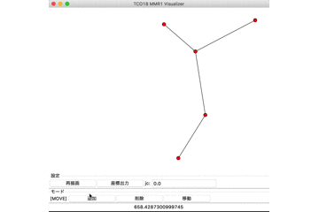

# TCO18MMR1_Visualizer


## Problems
https://community.topcoder.com/longcontest/?module=ViewProblemStatement&rd=17153&pm=14907

- ジャンクションの設置にコストや失敗がある最小シュタイナー木の構築が問題
- ジャンクションの設置位置が自明でなく、紙面上では検討が難しかった
- ぐりぐりしたい
- ぐりぐりできる

## Requirements
- Python
- Tkinter

## how to run
```
$ python python src/visualizer.py
```
